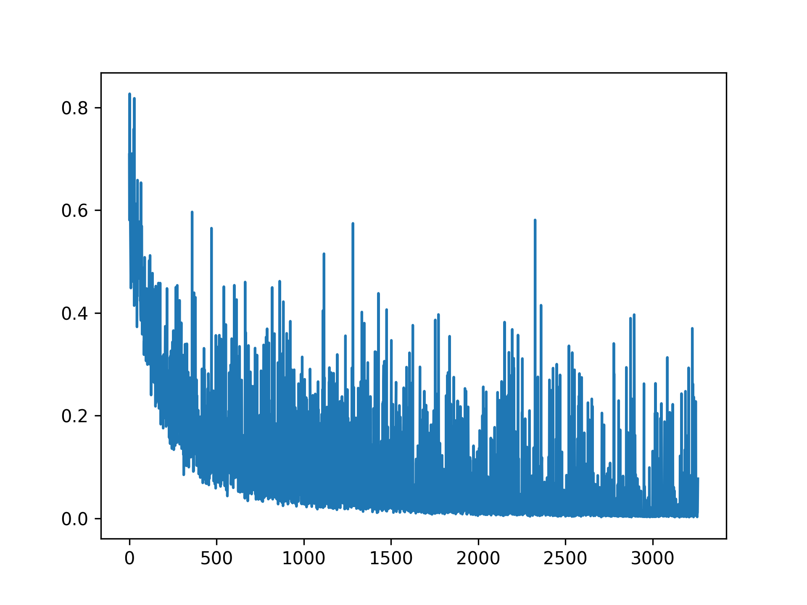
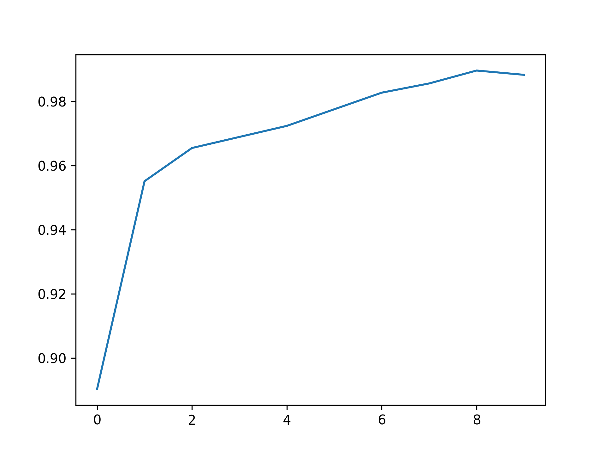

现在先xjb写一点，后面再重新整理
代码都没写完呢

# 基于液体神经网络的医学图像分类
液体神经网络是MIT那边提出来的，本模型中使用 **LTC(Liquid Time-constant Network)** 代替一般图像分类模型中的全连接层。图像特征采集部分仍然使用一般卷积层。

## 代码部分介绍

### model.py

model.py包括一些模型，比如LTC1，后续可能会添加其他模型作为对比。
+ LTC1：

    使用4个卷积层用于提取图片特征，随后输入LTC层进行分类。

+ 其他模型暂时还没加，反正过年这会儿不用汇报，开摆

------

### train.py

使用的数据集为Kaggle上的肺炎图像分类数据集，原本包含 (Bacteria，Normal，Virus) 三个类别，为了简化问题，我将 Bacteria 和 Virus 合并为 Abnormal，变为二分类问题。优化器使用Adam，损失函数使用交叉熵损失，为了训练效果美观，还研究了tqdm怎么用。后续会添加其他模型的训练函数用于比较各个模型。

------

## 训练结果
### train_loss

### train_acc

## 杂项

其实我看不太懂 LTC 那篇论文，但是感觉是个类似 RNN 的结构，确实可以用来代替模型中的全连接层，这样做可以减少模型参数的数量，但是可能会导致训练、推理速度下降（推测，后面可能会具体测试一下速度、耗时之类的）。

## 参考项目
+ LNN_cancer_classification
项目地址：https://github.com/safipatel/LNN-cancer-classification