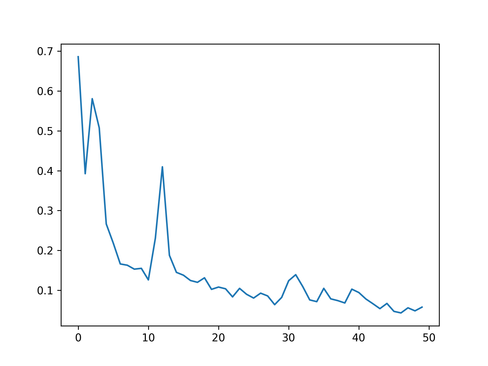
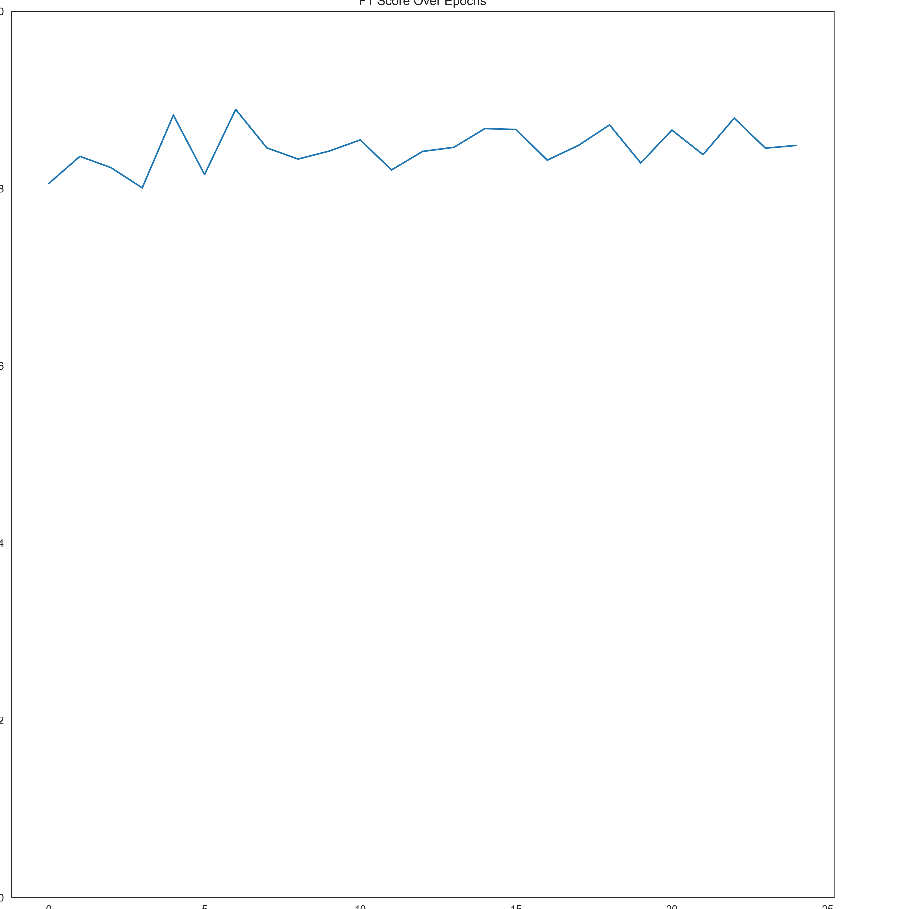

# 基于液体神经网络的医学图像分类
液体神经网络是MIT那边提出来的，本模型中使用 **LTC(Liquid Time-constant Network)** 代替一般图像分类模型中的全连接层。图像特征采集部分仍然使用一般卷积层。

## 代码部分介绍

### model.py

model.py包括一些模型，比如LTC1，后续可能会添加其他模型作为对比。
+ LTC1：

  使用4个卷积层用于提取图片特征，随后输入LTC层进行分类。相当于用LTC替换了Linear层。

+ CNN：

  CNN就是比较经典的卷积神经网络，用于对比分类准确度、参数量、推理速度等指标

  CNN模型使用的输入尺寸调整为 128*128, Train_epoch 为 50

  以上两个模型的测试结果并不理想，在训练集上的结果比较正常，但是使用测试集检验时，准确率和F1 score均出现了比较大幅度的波动。

+ ResNet:

  使用残差结构作为特征提取部分，进行图像分类。

+ ResNet_LTC:

  目前结果最好的模型，使用残差结构作为特征提取部分。随后使用CfCs模型进行分类，模型连接方式为自适应连接，共计使用28个神经元。后续需要测试不同神经元个数以及连接方式下，模型性能的变化。
  
  + 模型连接方式如下
  

+ 需要再找一两个别的模型做对比
------

### 数据集

使用Kaggle的 Chest X-Ray Images数据集进行测试，上文的ResNet 和 ResNet_LTC都是基于该数据集进行训练和测试。

在计划中需要对数据集进行进一步处理，例如使用数据增强方式

------
### train.py

使用的数据集为Kaggle上的肺炎图像分类数据集，包含(NORMAL, PNEUMONIA)两个类别，即二分类问题。优化器使用Adam，损失函数使用BCELoss。

在代码开头配置训练轮数，模型，输入图像尺寸，损失函数等参数。

训练过程会统计每个epoch的平均loss, 训练集准确率。并在训练完成后保存图表。

------

## 训练结果
##### 在此展示几个模型的训练过程，

### CNN Train_loss

### CNN Test_acc

### RenNet_LTC Train_loss

### ResNET_LTC Test_acc

### ResNet_LTC Test_F1

  虽然测试集上得到的F1_score仍然出现波动，但是波动幅度在0.82至0.9之间，相比CNN_model的F1_score波动，属于可以接受的幅度

## 其他

基本上ResNet_LTC那个模型就是最后结果了，会再搞几个别的模型，比如VGG，LeNET之类的模型换着跑一下结果作为对比。然后可能再加个数据增强水一下长度。

## 参考项目
+ LNN_cancer_classification
项目地址：https://github.com/safipatel/LNN-cancer-classification